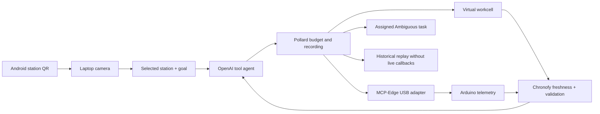

# Station Steward

**An agent that adapts to the tools it actually has—and hands the rest to a human.**

Station Steward is a local, laptop-hosted agent for two environments: a real Arduino sensor bench and a simulated robotic workcell. An Android phone displays a station QR passport. The laptop reads it, selects the environment, and lets an OpenAI tool agent inspect capabilities, interpret a goal, gather evidence, act where possible, and verify the result. When the station cannot perform the work, the agent creates an assigned task in Ambiguous.

Built for the **AI Tinkerers / OpenAI Agents Everywhere hackathon, Miami, September 12, 2026**.

[Submission description](SUBMISSION.md) · [Judge's guide](docs/JUDGING.md) · [Two-minute demo script](docs/DEMO.md) · [Architecture](docs/ARCHITECTURE.md) · [Hardware setup](docs/HARDWARE.md) · [Validation](docs/VALIDATION.md) · [Build story](docs/WRITEUP.md)

For a shared-workbench operator, a useful agent must turn a goal into verified work or an assigned next action. **The key demonstration is a real obstruction becoming a verified Ambiguous task:** the agent observes that the bench is blocked, discovers it has no actuator, and gives the remaining work to a person with the goal and evidence attached.

## What makes it agentic?

The model chooses tools across multiple turns and receives their actual results. It can choose a destination, encounter a changed scene or missing arm, re-observe, change its next action, or ask a person for help. The application checks every tool call and refuses unsupported actions or false completion claims.

| Environment | Agent can do | Requires a human |
|---|---|---|
| Virtual workcell | Discover an arm, observe two cans, define a placement goal, compare travel distances, move to empty slots, verify | Missing arm, unsupported goals, unresolved constraints |
| Arduino bench | Discover a read-only USB adapter, observe telemetry, verify an explicit minimum ultrasonic clearance | Clear an obstruction, inspect an unknown reading, provide missing hardware/control capability |

The Arduino's original temperature-triggered fan logic is ordinary firmware automation. The **agentic layer** is the model's capability discovery, evidence-based tool selection, replanning, verification, and persistent handoff. The laptop does not command the fan.

## A real result

In the live physical check, the UNO reported **2.3 cm** clearance against a **20 cm** goal. The agent requested human clearance, created an Ambiguous task assigned to the configured person, and read that task back successfully. The run used **4 model calls + 4 tool calls**, with **5,371 reported tokens**. Pollard replay reused all eight results without another model call, hardware observation, or task creation.

This was a direct backend test using real USB telemetry and real provider APIs. It did not simulate a new camera scan. Phone-to-laptop scanning was separately tested on the actual devices. Private workspace and task identifiers are excluded from this repository; [the public validation summary](docs/evidence/validation-summary.json) retains the outcome and counts.

## How it works



- **OpenAI Responses API:** actual function-calling loop; the model selects the next tool.
- **Pollard:** a shared model/tool step budget, separate model-call ceiling, usage accounting, recorded results and strict replay. Virtual move comparisons measure candidate travel without moving anything.
- **Chronofy:** separate freshness checks for QR observations, simulator state and USB telemetry. Fresh evidence from one source does not refresh another.
- **MCP-Edge:** a real `DeviceClient`, `DeviceRegistry` and `Gateway` route `uno/read_telemetry` through a read-only adapter for the existing sketch.
- **Ambiguous:** workspace verification, human assignment, task creation/read-back, durable duplicate prevention and read-only task status checks.
- **Regular QR:** a short session reference shown on an Android mobile webpage. No printer or Android app installation is required.

## Run locally

**Tested platform:** Windows, Python 3.12, Node.js 22.13+ (Node 24 used for validation), Git, and Chrome or Edge. The complete Ambiguous setup uses Windows credential encryption; full support on other operating systems is not established. Arduino hardware is optional for the virtual demo.

### 1. Install

From PowerShell:

```powershell
git clone https://github.com/jemsbhai/station-steward.git
cd station-steward
py -3.12 -m venv .venv
.\.venv\Scripts\python.exe -m pip install -r requirements-dev.txt
cd mobile
npm ci --include=optional
npm run build
cd ..
```

The three project libraries are pinned to the exact tested public Git commits in `requirements.txt`. No sibling repositories are needed. The npm lockfile is included. The static build manifest under `mobile/.openai/` contains no hosting credentials; no cloud deployment is required.

### 2. Configure the model and start

Enter your own OpenAI API key locally, without saving it in command history:

```powershell
$stationKey = Read-Host 'OpenAI API key' -AsSecureString
$env:OPENAI_API_KEY = [System.Net.NetworkCredential]::new('', $stationKey).Password
Remove-Variable stationKey
.\start-local.ps1
```

Open **http://localhost:8765/?view=camera** on the laptop. Keep the terminal running. The default model is `gpt-5.4-mini`; set `STATION_AGENT_MODEL` before launch to use another compatible model available to your account. Real missions make paid API calls. A `.env` file is not loaded automatically.

For another Arduino port or a manual phone address:

```powershell
.\start-local.ps1 -SerialPort COM5
.\start-local.ps1 -PhoneBaseUrl http://YOUR-LAPTOP-IP:8765
```

Connect the phone and laptop to the same network. Open the phone link shown by the app, or scan its connection QR. Some venue Wi-Fi networks isolate devices; a shared hotspot can help. The laptop camera runs on localhost; the phone only displays the QR and does not need camera permission.

For different networks or isolated venue Wi-Fi, use the [paired phone-only ngrok gateway](docs/TUNNEL.md). It keeps the main app and credentials on the laptop and provides a separate private pairing QR at `http://localhost:8766/pair`.

### 3. Try the virtual workcell

1. On the phone, select **Virtual workcell** and show its passport.
2. On the laptop, start the camera and scan the passport.
3. Run **Clear staging** or **Sort the cans** within 30 seconds of the scan.
4. Watch actual tool choices in the activity log. Disconnect the virtual arm or swap can positions to test adaptation.
5. Try a four-step budget, then **Replay mission** to inspect historical results without new actions.

The scene uses discrete slots, not robot physics. If screens reflect into one another, use **Dark-screen scan · 3s delay**, tilt the phone, and reduce brightness when the QR is washed out.

### 4. Try the physical bench

Follow [the hardware guide](docs/HARDWARE.md). Keep a bare motor disconnected from Arduino signal pins; the included updated sketch disables its output until a suitable driver is established. Firmware upload is a separate user action.

1. Close Arduino Serial Monitor and select **Connect COM3** (or your configured port) in the laptop app.
2. On the phone, choose **Arduino bench** and scan its passport.
3. Run **Check 20 cm clearance**.
4. A flat object around 10 cm away should produce a blocked reading. Around 30 cm provides a passing condition when fresh valid readings are received. No echo means unknown, not clear.

DHT temperature/humidity are explicitly labeled cached with unknown sample age. The interface shows any reported DHT read failure. Fan ON/OFF is firmware-reported; rotation and airflow are not measured.

### 5. Enable real human handoffs

1. Create/select your own [Ambiguous workspace](https://app.ambiguous.ai/) and follow its [Connect/authentication instructions](https://www.ambiguous.ai/auth.md).
2. In **Human handoffs · Ambiguous**, paste the API key into the local password field.
3. Confirm the returned identity/workspace, choose a human assignee and optional project, then **Enable task handoffs**.
4. Run a blocked mission and follow its task link. **Check task status** reads the existing task; marking it done is a human report, not proof the station changed.

One workspace is connected at a time. Without a connection, requests for help remain local pending records. The live demo used a human API identity; a separate Ambiguous agent identity has not been provisioned as part of this implementation.

## Bounds and honest limitations

| Control | Current behavior |
|---|---|
| Mission budget | Default 24 combined model/tool calls; hard ceiling of 10 model calls |
| Usage | Reported token accounting; no hard token or dollar ceiling |
| QR | Five-minute passport; newest session only; 30 decode attempts; scan fresh for 30 seconds at mission start |
| Virtual evidence | 30-second freshness plus an exact scene revision |
| Physical evidence | Recorded and latest samples each under 3 seconds old, same USB session, valid distance and goal predicate |
| Replay | Reuses recorded outcomes; no model/provider calls, hardware reads, movement or freshness refresh |
| Handoffs | Durable reservation before POST; no automatic repeat POST after uncertainty; recovery searches for the existing task |
| Persistence | QR/mission/simulator state is in memory; encrypted Ambiguous connection and delivery journal persist locally |

The system does not control a physical arm or motor, pour drinks, prove DHT freshness, authenticate arbitrary internet users, autonomously handle incoming Ambiguous tasks, or integrate CopilotKit/Exa/OpenRouter. MultiSpecQR was replaced with ordinary QR after screen-reflection trials. These are stated boundaries, not hidden mock integrations.

This is a trusted local demo companion. Privileged browser controls require localhost and matching origin. Do not point a public tunnel directly at the main app; use the [restricted phone gateway](docs/TUNNEL.md) for temporary remote phone access. Camera frames are decoded locally and not sent to the model; goals and tool results, including sensor values, are sent to the model. Raw frames are not retained.

## Tests and evidence

```powershell
.\.venv\Scripts\python.exe -m pytest -q
cd mobile
npm run build
npx tsc --noEmit
```

**117 offline tests passed** during the hackathon, covering real QR encode/decode, budgets, replay, stale/revised evidence, physical parsing, station-specific tools, localhost controls, encrypted credentials, task read-back and timeout recovery. These tests use controlled model/provider responses and do not spend API credit or open the real serial port.

The subsequent phone-tunnel helper adds 11 focused access-boundary checks, and reset has two regression checks; the combined suite has **130 passing tests**.

The published source was also exported into a separate directory and installed with a fresh Python environment and npm dependencies. All 117 tests, the production frontend build and TypeScript check passed there. No sibling library checkouts or private runtime files were needed. Build before type-checking so Vinext can generate its route declarations. [Reproduction details](docs/VALIDATION.md#clean-publication-check).

The explicit scripts `scripts/smoke_agent.py` and `scripts/smoke_bench.py` make live calls. The bench check opens the physical port; `--live-handoff` may create a real task in the enabled destination. Stop the main app first so one process owns the port and journal. Raw receipts go to ignored `artifacts/` and may contain private task metadata. See [validation details](docs/VALIDATION.md) before using them.

## Repository map

| Path | Purpose |
|---|---|
| `station_steward/agent.py` | Model loop, goals, tool validation, budgets and replay |
| `station_steward/hardware.py` | Bounded read-only serial parser and MCP-Edge adapter |
| `station_steward/ambiguous.py` | Encrypted connection, assigned delivery, read-back and recovery |
| `station_steward/app.py` | QR sessions, API and local static frontend hosting |
| `mobile/` | Phone display, laptop camera, agent controls and live bench UI |
| `hardware/station_bench/` | D7 sketch with motor output disabled by default |
| `tests/` | Offline behavior and failure-path checks |
| `docs/` | Architecture, build story, demo, hardware and validation writeups |

## Built here, built on

The hackathon work is the Station Steward application: station passport flow, virtual simulator, agent tool loop, hardware adapter, evidence policies, handoff delivery and recovery, interface, tests and documentation. The supplied Arduino sketch was adapted for a disabled D7 motor output. It is not a new general-purpose robot controller.

**Pollard, Chronofy and MCP-Edge predate this project.** They are credited as existing libraries, not work created during the hackathon. Their exact source revisions are pinned:

- [Pollard 0.4.0](https://github.com/jemsbhai/pollard/tree/ddd4b85ea77b4cc46bbf5fb9432efd9883123557)
- [Chronofy 0.1.9](https://github.com/jemsbhai/chronofy/tree/c3eb0c32392282ec97fbab5da4d79ec6c14e5556)
- [MCP-Edge 0.2.0](https://github.com/jemsbhai/mcp-edge/tree/95632bfde510b57c0bb31bb284aa5bd21317eb09)

The frontend began from a Sites/Vinext scaffold and uses React, Tailwind and supplied UI components. QR generation/decoding uses qrcode and pyzbar/ZBar. See each dependency's repository/package for its license and attribution.

Primary references: [OpenAI function calling](https://developers.openai.com/api/docs/guides/function-calling), [Ambiguous API](https://app.ambiguous.ai/api/openapi.json), [hackathon sponsor integration guide](https://github.com/CopilotKit/agents-everywhere-starter-kit/blob/main/using-sponsor-tools.md).
